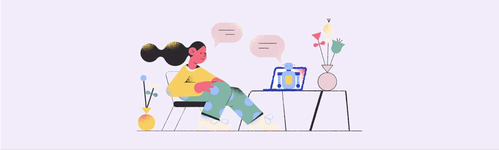BotKitandMessageEvents

> **About** **thiscourse**
>
> **Prerequisites**

**BOTKIT** **INTRODUCTION**

> **What** **isthe** **BotKit** **SDK?**
>
> **Eventsforthe** **BotKit** **SDK**
>
> **Functionsforthe** **BotKit** **SDK**
>
> **Review** **TermsforSettingupthe** **BotKit** **SDK**

**BOTKIT** **INSTALLATION**

> **The** **BotKit** **SDK**
>
> **Testingthe** **BotKit**
>
> **TroubleshootingBotKit**

**TEST** **YOUR** **UNDERSTANDING**

> **Check** **YourUnderstanding**

**CONCLUSION**

> **Summary**

Lesson 1 of 11

**About** **this** **course**

> The **Kore.ai** **BotKit** **SDK** is a set of libraries that enable
> interaction control between
>
> users and the assistants you build on **Kore.ai** **XO** **Platform**.
> In this course, you will learn
>
> how to install, configure, and integrate the **Kore.ai** **BotKit**
> with your virtual assistant.
>
> **CourseObjectives**
>
> By the end of this course, you will be able to:
>
> 1 Download, extract and configure the files for your **BotKit**
> **SDK.**
>
> 2 Download and launch the programs needed to run **BotKit** on your
> local computer (**Redis,** **Node.JS** **andNGrok**).
>
> 3 Copy and configure a new JS file in your **BotKit** to detect and
> respond to a specific user utterance.
>
> 4 Test the bot using **Talk** **to** **Bot.**
>
> **Product**
> **Version**
>
> This course is developed for Experience Optimization (XO Platform
> version 10.0.
>
> **CourseRequirements**
>
> **Requirementsforcompletingthiscourse:**
>
> Complete the course and pass the end of the course assessment with a
> min **80%** **score**.
>
> Fill out and submit the **Feedback** **Survey** at the end of the
>
> course
>
> Course Duration**:** **1hour**
>
> **CONTINUE**

Lesson 2 of 11

**Prerequisites**

> **BeforeYou** **Begin**
>
> We recommend you complete the below courses before starting this
> course:
>
> Introduction to Kore.ai Experience Optimization Platform
>
> Designing Conversation Prototypes
>
> Basic building blocks of Dialog Flow
>
> **CONTINUE**

Lesson 3 of 11

**What** **is** **the** **BotKit** **SDK?**

> The Kore.ai BotKit SDK is a set of libraries that enable interaction
> control between users
>
> and the assistants you build on the Kore.ai XO Platform.
>
> When you build a dialog task using Dialog Editor in the XO Platform,
> you can subscribe
>
> to message and webhook events by adding event handlers and controlling
> the
>
> messages and webhook events using the SDK. Watch this video to learn
> how Botkit is
>
> used
> for virtual assistants (VA.

**VideoTranscript** –

Our BotKit SDK allows you to have precise control over your virtual
assistant so you can handle specific events in any way that you choose.
BotKit is designed to reside on your servers and can function on the
web, iOS or Android platforms, and it allows you to facilitate
specialized

interactions between the bot user and the Kore.ai XO Platform by
intercepting and influencing the flow of the conversation dialog.

Here’s how your virtual assistant works without the BotKit. A message is
sent from one of your deployed channels into your bot framework, it is
immediately processed by the Kore.ai NLU engine and a response is sent
back to the user.

When you have installed and configured BotKit, it works like this.
First, a message is sent from one of your channels into your Bot
Framework. Depending on which events you have subscribed to, the message
itself or a node in the triggered Dialog, can route the user message to
be sent to the BotKit. The BotKit will respond according to the
instructions you have built and that response will then pass through the
NLU to the framework and back to the user.

Some of the events that can trigger the Botkit SDK are: a specific user
utterance, completion of a Dialog Task, a webhook node and an agent
transfer node. This means you can execute your own business logic,
perform server side validation, analyze and respond to messages and
perform database queries.

> You can integrate event handling using the **BotKit** **SDK** by
> externally capturing and
>
> responding to event types such as:
>
> Messages
>
> Feedback Surveys
>
> Webhooks
>
> Agent Transfers
>
> Variable changes
>
> **CONTINUE** **TO** **LEARN** **MORE**

Lesson 4 of 11

**Events** **for** **the** **BotKit** **SDK**

> You can use the **Kore.ai** **BotKit** **SDK** to **capture**
> **andhandle** **events** in the Bots Platform for better **control**
> and customization of the **user’s** **experience** with the Virtual
> Assistant that you are building. **Seven** **events** are supported by
> the BotKit SDK.
>
> **Flipeachcardtolearnabout** **the** **typesof** **eventsyoucan**
> **capture** **andhandle** **withthe** **BotKit** **SDK.**

||
||
||
||
||
||
||
||
||
||

||
||
||
||
||
||
||
||
||

||
||
||
||
||
||
||
||
||

> onClientEvent is triggered on
>
> onClientEvent client_event when the assistant receives client events
> sent by
>
> the third party application.
>
> For
> more details about Events, [<u>view our
> documentation.</u>](https://developer.kore.ai/docs/bots/sdks/sdk-events/)
>
> **CONTINUE** **TO** **LEARN** **MORE**

Lesson 5 of 11

**Functions** **for** **the** **BotKit** **SDK**

> The **Kore.ai** **BotKit** **SDK** provides functions that you can use
> when writing your **BotKit**
>
> **JavaScript** **instruction** **files**. These functions allow for
> greater control of your
>
> assistant and provide a better user experience.
>
> The following functions are supported by the **BotKit** **SDK.**
>
> sdk.sendUserMessage
>
> sdk.sendBotMessage
>
> sdk.AsyncResponse
>
> sdk.respondToHook
>
> sdk.saveData
>
> sdk.registerBot
>
> sdk.getSavedData
>
> sdk.getMessages
>
> sdk.resetBot
>
> sdk.startAgentSession
>
> sdk.clearAgentSession
>
> sdk.extendRequestId
>
> sdk.skipUserMessage
>
> sdk.skipBotMessage
>
> sdk.closeConversationSession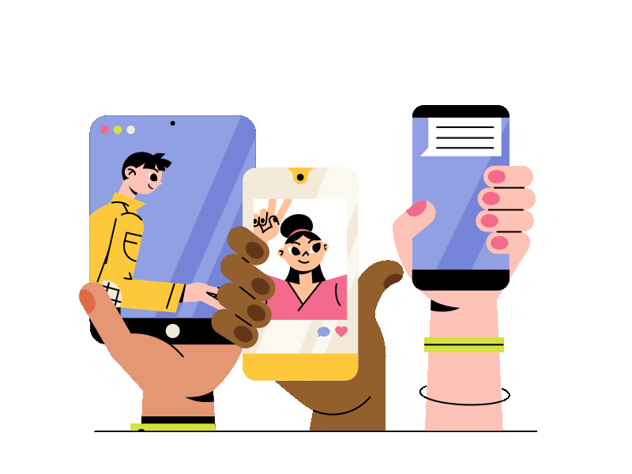 style="width:6.375in;height:4.78125in" />
>
> For
> more details about the functions, [<u>view our
> documentation.</u>](https://developer.kore.ai/docs/bots/sdks/functions-for-the-botkit-sdk/)
>
> The functions will be useful to you later, once you have installed the
> **BotKit** **SDK** and start creating your **Java** **Script**
> **event** **handler** **files.**
>
> **CONTINUE** **TO** **LEARN** **MORE**

Lesson 6 of 11

**Review** **Terms** **for** **Setting** **up** **the** **BotKit**
**SDK**

> Here are some common terms and features we will use in this course.
> Becoming
>
> familiar with them before beginning the installation process will be
> helpful for you.

||
||
||
||
||
||
||

||
||
||
||

service.

> **CONTINUE** **TO** **LEARN** **MORE**

Lesson 7 of 11

**The** **BotKit** **SDK**

> **What** **istheBotKit** **SDK?**
>
> The **Kore.ai** **BotKit** **SDK** is a set of libraries that enable
> interaction control between
>
> users and the assistants you build on **Kore.ai** **XO** **Platform**.
> The **BotKit** has multiple
>
> event and message handling applications such as **Agent**
> **Transfer**, **Feedback** **Survey**
>
> messages, and of course, **Webhook** **events**.
>
> This lesson will walk you through all of the prerequisite steps you
> need to perform in
>
> order to properly use the **BotKit** **SDK.**
>
> **1**
>
> **Createan** **App**
>
> First, go to **Deploy\>Manage** **Apps** and create an **App**.
>
> **Name** the app
>
> Choose to enforce either **JTI** **Claim** **orEnforce** **JWE**
> **Encryption**
>
> Click **Next** and **Done.**

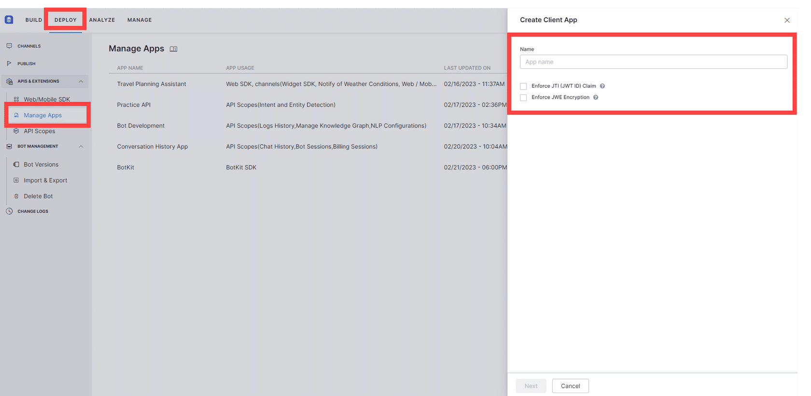

> **2**
>
> **Add** **theApp** **to** **BotKit**
>
> Go to **Build\>Integrations\>BotKit** and add the **App** you made.
> The **AppDetails** will
>
> appear along with a field for your **Callback** **URL** (we will add
> this later using a URL
>
> provided by NGrock) and a list of **Events** you can control using the
> **BotKit** **SDK**. Select
>
> the events you want to use and click **Save.**

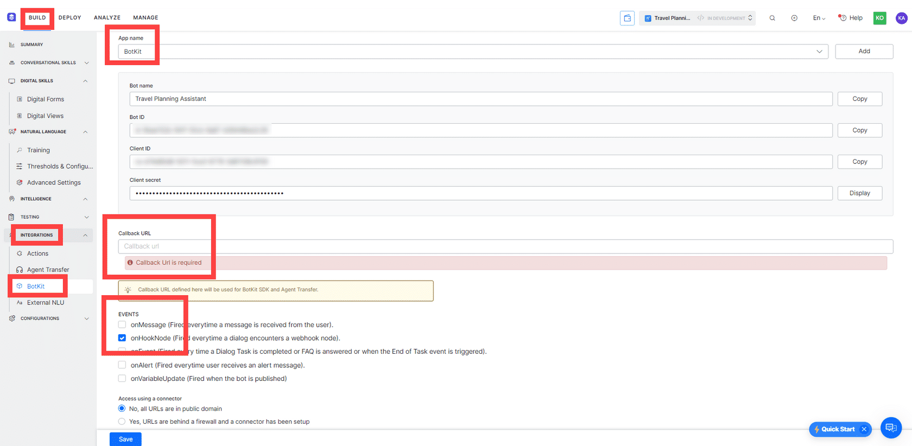

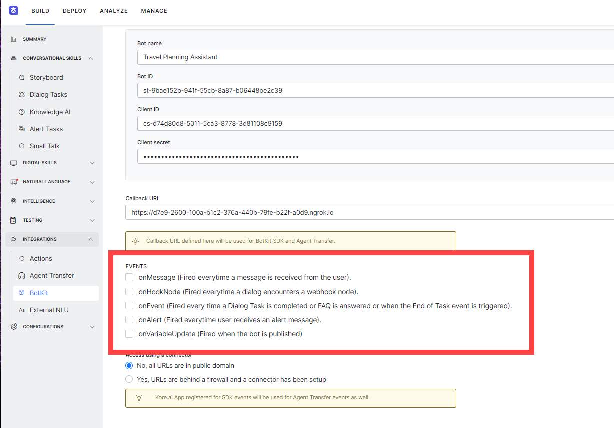

> **Choosing** **BotKit** **Events**
>
> You can choose one or more events for your **BotKit** to process.
> Scroll through the five
>
> events to learn more about each one.
>
> **Step** **1**

**onMessage**

**BotKit** processes every message when you select **onMessage**. This
could be useful for

catching foul language, highly agitated customers or some other high
priority behavior that

can be identified by a user utterance.

> **Step** **2**

**OnHookNode**

The **BotKit** will be triggered anytime a **Webhooknode** is
encountered in a Dialog Task.

> You can build either synchronous or asynchronous **Webhooks.**
>
> **Step** **3**

**onEvent**

The **BotKit** will be triggered every time a **Dialog** **Taskor**
**FAQ** is finished.

> **Step** **4**

**onAlert**

This event causes the **BotKit** to be triggered when the user receives
an **alertmessage.**

> **Step** **5**

**onVariableUpdate**

This event only triggers the **BotKit** when the bot is published.

> **BotKit** **Events**
>
> Selecting only the events you want to use for triggering your BotKit
> will make your personal
>
> assistant run efficiently and intelligently.

 **~~3~~**

> **Download** **theBotKit** **SDKlibrary**
>
> You will need to download the zipped library from the [<u>GitHub
> repositor</u>y<u>.</u>](https://github.com/Koredotcom/BotKit)
>
> Click **Code** and then **DownloadZIP.**
>
> Once downloaded, you will open the ZIPPED file and UNZIP it (on
> **Windows** this will be an **Extract** **All** option)
>
> 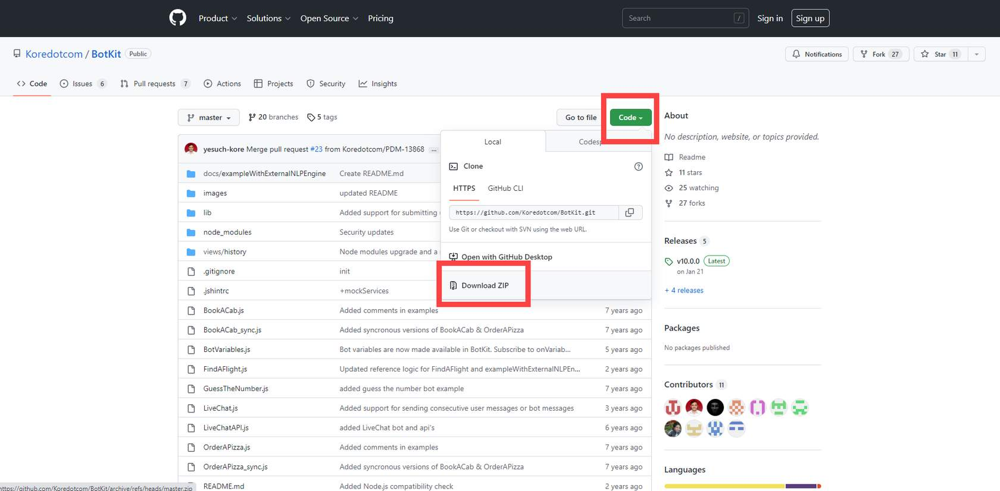 style="width:6.375in;height:3.13542in" /> style="width:0.52083in;height:0.52083in" />**4**
>
> **Open** **theBotKit** **config** **file**
>
> Open the UNZIPPED **BotKit** **folder** and double click the
> **configfile** to open it.
>
> 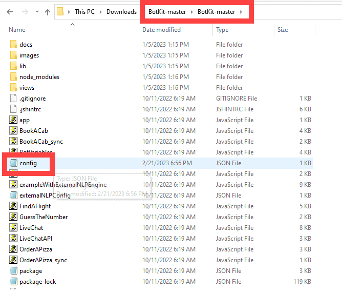 style="width:6.375in;height:5.44792in" /> style="width:0.52083in;height:0.52083in" />**5**
>
> **Makechangesto** **theconfig** **file.**
>
> **Port**  By default, it is set to 8003, but you might need to change
> it.
>
> **Bot** **ID**  This is your bot ID that starts with st- You can
> return to the app you made to
>
> copy this.
>
> **Client** **Secret**  This is pasted into the apikey section. You
> can return to the app you
>
> made to copy this.
>
> **Client** **ID**  This is pasted into the appId section. You can
> return to the app you made
>
> to copy this.
>
> **Available**  You will need to change this to 'true'

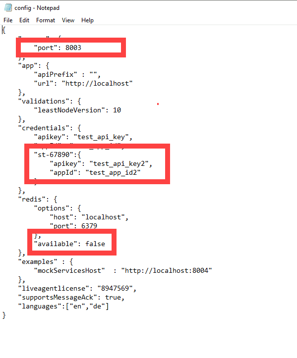

> **6**
>
> **Download** **Redis**
>
> Redis is used for data structure storage. You will need to
> [<u>download the folder</u>](https://redis.io/download/) and
>
> unzip the contents.
>
> **7**
>
> **Download** **node.JS**
>
> Now you need to [<u>download
> node.JS</u>](https://nodejs.org/en/download/) to use for the
> server-side JavaScript runtime
>
> environment that allows communication between your server and the
> Kore.ai XO
>
> Platform.

 **~~8~~**

> **Download** **and** **Install** **nGrok**
>
> nGrok is used to simulate your callback server application. Once you
> [<u>download the files</u>](https://ngrok.com/download)
>
> , you will install nGrok.
>
> [**If** **you** **need** **more** **assistance** **setting** **up**
> **your** **BotKit,**
> **<u>consult</u>**](https://developer.kore.ai/docs/bots/sdks/installing-the-botkit-sdk/)
> [**<u>our
> documentation.</u>**](https://developer.kore.ai/docs/bots/sdks/installing-the-botkit-sdk/)
>
> Next, we will test the **BotKit** to be sure it's working.
>
> **CONTINUE** **TO** **LEARN** **MORE**

Lesson 8 of 11

**Testing** **the** **BotKit**

> **Prerequisites**
>
> Be sure you have completed each of these steps before continuing.
>
> Create an app and add it to the **BotKit** on the **XO** **platform.**
>
> Under **BotKit** on the **XO** **platform**, add the app, and under
> **Events**
>
> choose onMessage. The **Callback** **URL** is blank, but we will
> update that in a moment.
>
> Download and unzip the **BotKit** **SDK** **files.**
>
> Within the **BotKit** **SDK** **files**, open and edit the
> **Configfile** details:
>
> **Bot** **ID,** **Client** **ID,** **Client** **Secret**, and set
> **Availability** to True.
>
> Download and unzip **Redis.**
>
> Download and install **node.JS.**
>
> Download and install **nGrok.**
>
>  style="width:6.375in;height:4.78125in" />Let's get started!
>
> **1**
>
> **Edit** **the** **'Simple** **Conversational** **Bot'** **file**
>
> In order to test that everything works, we will configure the existing
> **Simple**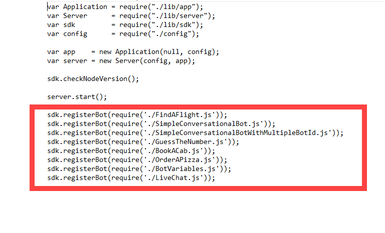 style="width:6.375in;height:3.86458in" />
>
> **Conversational** **Bot** **file** with the proper **Bot** **ID** and
> **Bot** **name.** This will allow you to
>
> test if your **BotKit** is working.
>
> This is your**app.JS** **file** where you needto addthe new JS files
> you create. All the sample files have already been includedhere.
>
> 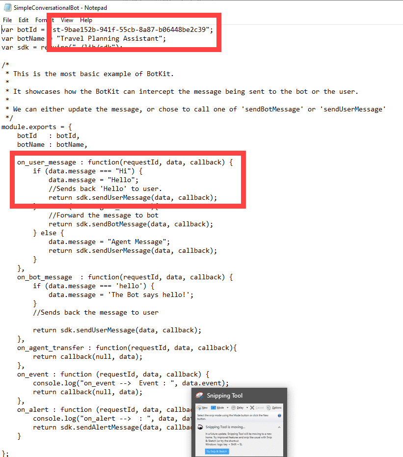 style="width:6.375in;height:7.22917in" />This is a **JS** **file**.
> Atthe top,you needto change the **botID** **and** **botName** to match
> yourbot details. The code thatfollows will be the instructions
> forhandling the use case. In this example,if the usersays Hi,then the
> botwill say Hello.
>
>  style="width:0.52083in;height:0.52081in" />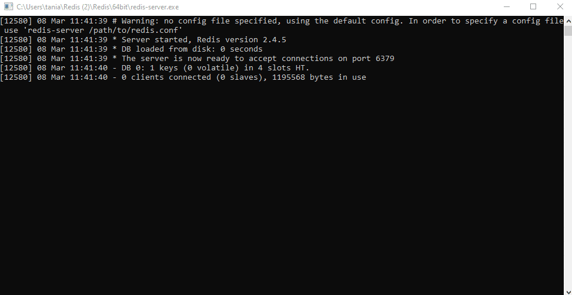 style="width:6.375in;height:3.29167in" />**2**
>
> **Launch** **Redis**
>
> You can type redis-server in a **command** **panel** or open the
> **Redisfolder**, open **32or64bit**
>
> depending on your computer, and then double-click **redis-server**.
>
> An active **command** **panel** will appear.

 **~~3~~**

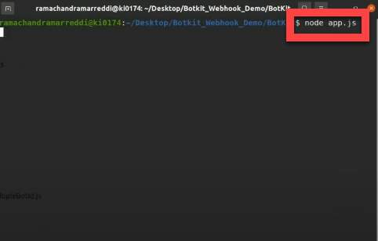**Launch** **BotKit**
**usingNode.js**

In a Command panel launch your BotKit by typing node app.js (or the
correct file location for the

BotKit app.js file).

> **4**

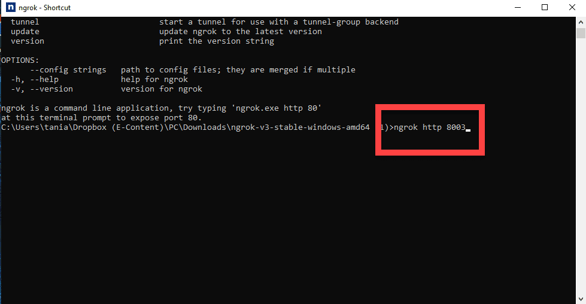**Launch**
**NGrok**

Open NGrok or a command panel.

Type ngrok http 8003 and then the **Enterkey.**

> **UpdatethenGrok** **URLin** **BotKit**

**nGrokisrunning**

You need to copy the **Forwarding** **URL** and paste that into your app
as the **Callback** **URL** and

then **Save.**

> 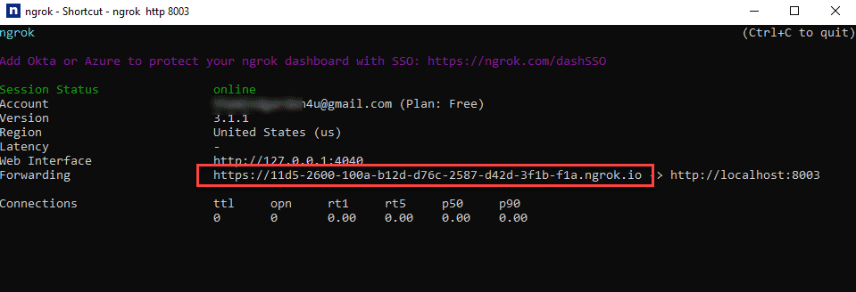 style="width:6.375in;height:2.17708in" />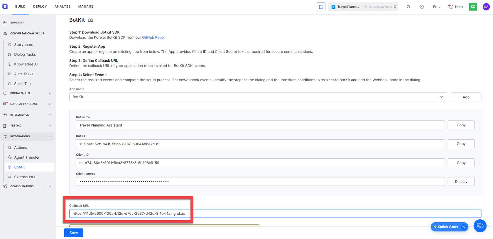 style="width:6.375in;height:3.10417in" />Copy the nGrok **Forwarding**
> **URL** andpaste itinto the **BotKit** **Callback** **URL** **field.**
> Click **Save.**
>
> **5**

Use **Talk** **to** **Bot** to confirm that you can connect with the
**BotKit**.

**SayHitoseeifthebotsaysHello**

The **BotKit**should return a bot message of Hello when you say Hi on
**Talk** **toBot.** You can

launch the **Debugger** to see how the conversation is being routed. You
can also watch your

**NGrok** **logs** to see if everything is working properly.

> You
> might want to copy an existing use case and modify it as
>
> needed or you might even build your own file from scratch. Either way,
> each **JS** **file** added to the **BotKit** **SDK** **folder** will
> need
>
> to include the **Bot** **Name** and **Bot** **ID** and must be
> configured into
>
> the **app.JS** **file.**
>
> **Remember** **that** **you** **can** **usethesefunctionswhen**
> **writing** **your** **JScode.**
>
> sdk.sendUserMessage
>
> sdk.sendBotMessage
>
> sdk.AsyncResponse
>
> sdk.respondToHook
>
> sdk.saveData
>
> sdk.registerBot
>
> sdk.getSavedData
>
> sdk.getMessages
>
> sdk.resetBot
>
> sdk.startAgentSession
>
> sdk.clearAgentSession
>
> sdk.extendRequestId
>
> sdk.skipUserMessage
>
> sdk.skipBotMessage
>
> sdk.closeConversationSession
>
> Recall that the **onMessage** **event** consists of two components:
> **onUserMessage** and **onBotMessage.** In
>
> this video, I will show you the process of configuring an
> **onMessage**
> **event.**

**VideoTranscript** –

The Kore.ai BotKit SDK runs as a Node.js application. You can add your
own reverse proxy, firewall, and load balancer to meet your functional
requirements for availability, scalability, and performance. You can
also use any Node.js application but I’ll show you the one I use, which
is Node.JS.

First, let’s review. I downloaded the BotKit from GitHub and extracted
all of the files. I chose to rename the BotKit master file to Sample BK.
I opened my Config file and added my bot id, client id, client secret
and I set my availability to true. I downloaded and placed Node.JS into
the Sample BK folder. I downloaded Redis and NGrok.

I created an app and added the app to BotKit. I’ve chosen to send every
message into the BotKit. I will still need to transfer the new Callback
URL from NGrok once I get started.

But, before that, I need to configure one of the JavaScript files to
handle an event. I’m going to make a copy of the Simple Conversational
Bot file and I’ll name this SimpleConvo. I’ll add my bot name and bot ID
at the top of the page.

Here are the default instructions for handling a user message. If the
user says Hi, then the bot will say Hello. I’m changing that to: If the
user says “Howdy”, the bot will say “Howdy, Partner.” I will add an
additional line of code to handle another user utterance. If the user
says, “Wuts up bro?” The bot will say, “Not much. Just chillen.” You can
see that there are other conditions we can respond to, but we will leave
it as is. We will save this.

Now, we need to add that file title to our app.js file so the BotKit
will recognize and execute these instructions.

Now, we are ready to test this with Talk to Bot. I’ll launch Redis. Then
I’ll launch my BotKit with NodeJS. Finally, I’ll initiate NGrok. Now I
need to update my Callback URL. Perfect. I’ll launch Talk to Bot and
open the Dubugger.

You can watch how the conversation flows. The message is sent to BotKit
and then we see that BotKit has returned a message. That’s how we know
that response truly came from BotKit and not from a dialog task or small
talk.

We can also see the conversation here, on NGrok. Now that we know it’s
working, I can start building out other responses to other events and I
can create new sets of JavaScript instructions for my BotKit.

You can open the other JavaScript instructional files to see examples of
how to build efficient code to handle complex problems. For example,
Book a Cab will show you a sample code for using webhooks. dataStore
will show you how to add, update or delete data from data storage
tables. Live Chat will show you how to connect with agent desktop
software.

Now, one thing you might have noticed is that I didn’t have to publish
my bot in order to activate the changes within my BotKit folder. The
changes take effect immediately within Bot Builder, but in order for my
deployed channels to access BotKit, I will need to publish the bot.

Occasionally, after publishing, your BotKit will have errors and this
could shut down your entire bot. If that happens, just open up your
BotKit page and unclick ‘onmessages’ so that BotKit doesn’t process all
dialogs. This will allow you the proper time to troubleshoot the errors
in your BotKit and you can turn it back on the onmessages event once
you’ve debugged the BotKit SDK.

> **Rememberthat**
> **the** **onMessage** **event** **isone** **of** **many**
> **eventsyou**
>
> **can** **capture** **andhandle** **usingthe** **BotKit** **SDK.**
> **The** **othersare:** **onWebhook,** **onAgentTransfer,**
> **onEvent,** **onAlert,** **onVariableUpdate,** **andonClientEvent.**
>
> Next, we will cover some troubleshooting ideas.
>
> **CONTINUE** **TO** **LEARN** **MORE**

Lesson 9 of 11

**Troubleshooting** **BotKit**

> **Having** **problems?**
>
> If you've never set up an **SDK** before, you might run into a few
> problems. Here are
>
> some
> common problems and their simple solutions.

**Problem:**

You can't get **Node.JS** to open the

**BotKit** **app.jsfile.**

**Solutions:**

1\. The **BotKit** needs to be in the same local directory

as **Node.JS**.

> 2\. Be sure you've included the full path name to
>
> access your **BotKit** **files.**
>
> 3\. You can also try a different **Node.JS** **commandfile**
>
> to launch **app.JS.**

**Problem:**

You have **Redis,** **Node.JS** **andNGrok**

running, but you can't get a user

message to go through.

**Solutions:**

1\. Be sure your **configfile** has been setup properly

with your **Bot** **ID,** **AppID,** **Appsecret** and the

**Availability** set to true.

> 2\. Make sure you have updated the **NGrok** **url** on the
>
> **BotKit** **page** on the XO platform since it will change
>
> EVERY TIME you launch **NGrok.**

**Problem:**

Messages are sent to the

**BotKit** but you aren't getting

any response back.

**Solution:**

1\. Be sure you have edited an existing or created a new **Java**

**Script** **file** to handle the user input.

> 2\. The **bot** **ID**and **bot** **name** need to be at the top of
> every **JS**
>
> **page** you want to use and if it's a new file, the file name needs
>
> to be added to your **app.JS** **file.**

**Problem:**

My bot isn't working on any of

my deployed channels because

of errors in the **BotKit.**

**Solution:**

You can navigate to **Build\>Integrations\>BotKit** and uncheck

the 'Onmessage' event. Now your bot will continue working

while you troubleshoot the **BotKit** **SDK** **files.**

> Next, you will review everything you've learned so far!
>
> **CONTINUE** **TO** **LEARN** **MORE**

Lesson 10 of 11

**Check** **Your** **Understanding**

In order to get credit, you must pass the knowledge check.

**Total** **numberof** **questions:** **10**

**Passingscore:** 80%

**Numberof** **attempts:** unlimited

Good Luck!

**Question**

01/10

The Kore.ai BotKit SDK runs as a Node.js application.

> True
>
> False

**Question**

02/10

Which statements are true?

> Our BotKit SDK is designed to reside on your servers.
>
> BotKit merges many dialog tasks into one large dialog task.
>
> BotKit can function on the web, iOS, or Android platforms.
>
> BotKit enables you to facilitate specialized interactions between the
> bot user and the Kore.ai platform.

**Question**

03/10

What are some of the events that can trigger the BotKit SDK?

> A specific user utterance
>
> The completion of a dialog task
>
> A webhook node
>
> An agent transfer node
>
> A cyberattack
>
> A batch test
>
> Alert messages

**Question**

04/10

Match the steps to their order.

> Download the Botkit from Github
>
> Register an app within Kore.ai
>
> Generate the Callback URL from NGrok
>
> Select the events that will be relayed into the BotKit

4

3

2

1

**Question**

05/10

IntelliJ is the only node.JS IDE that will work with BotKit.

> True
>
> False

**Question**

06/10

When you create a new JS file for the BotKit, you need to add it to
which file?

> app.js file
>
> config.JSON
>
> GitHub

**Question**

07/10

Changes to the BotKit take effect immediately, across all channels.

> True
>
> False

**Question**

08/10

What two things must be changed/added to every JavaScript file that is
used by

your BotKit? Choose all that apply.

> Bot name
>
> Bot ID
>
> Client secret
>
> Client ID

**Question**

09/10

Match each tool to the BotKit SDK purpose.

> NGrok
>
> Node.JS
>
> BotKit SDK
>
> BotKit Call back URL
>
> Redis

Bot instructions

Data storage

Launch BotKit files locally

Local server

Directs bot/user traffic

**Question**

10/10

Which of the following features need to be updated on your BotKit config
file?

Choose all that apply.

> Bot ID
>
> Client ID
>
> Client secret
>
> Availability
>
> Callback URL
>
> Event selections

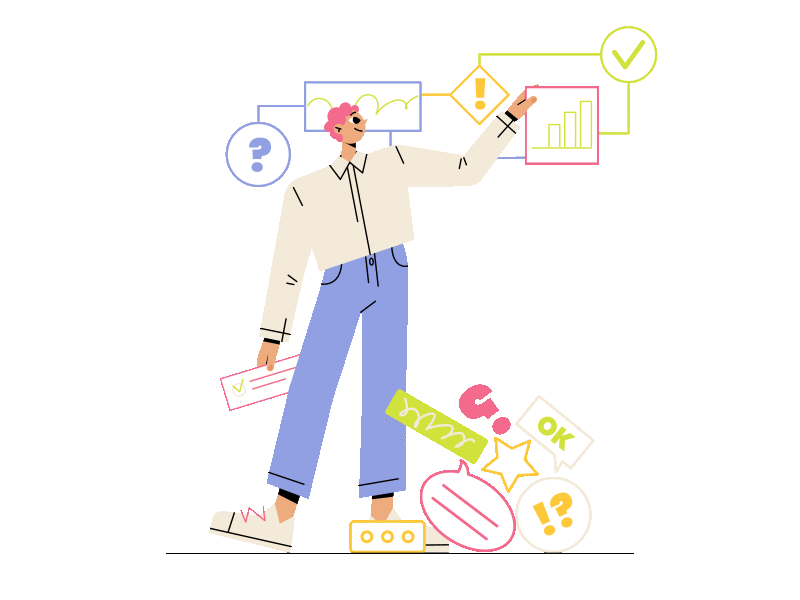

Lesson 11 of 11

**Summary**

> **TheBotKitSDKallowsyoutoexternallycontroltheresponsetovariousevents.**
>
> This means you can customize your bot responses within the privacy of
> your own servers. This
>
> gives you full control over your virtual assistants interactions.
>
> **Key** **Takeaways**
>
> Here is what you have learned in this course.
>
> How to download, extract and configure the files for your **BotKit**
>
> **SDK.**
>
> How to download and launch the programs needed to run
>
> **BotKit** on your local computer (**Redis,** **Node.JS**
> **andNGrok**).
>
> How to copy and configure a new JS file in your **BotKit** to detect
>
> and respond to a specific user utterance, and then test it using
>
> **Talk** **to** **Bot.**
>
> **Check**
> **out** **ourdocumentation** **orourKore.ai** **Academy** **formore**
>
> **details!**
>
> Thanks for completing the course!
