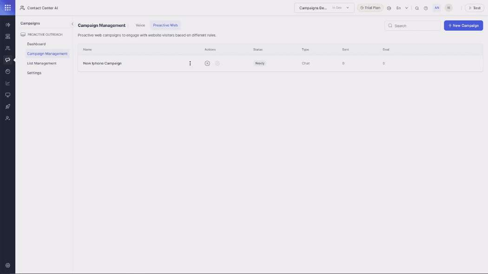
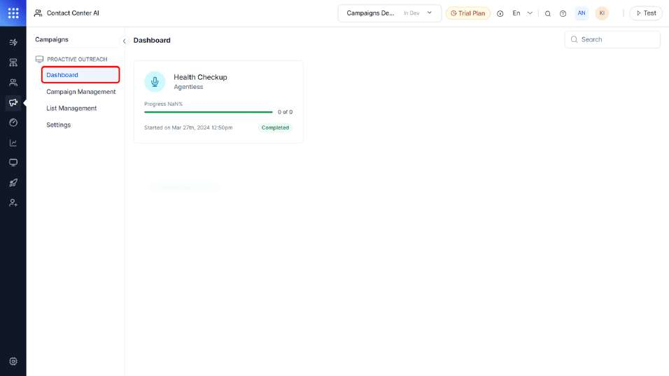
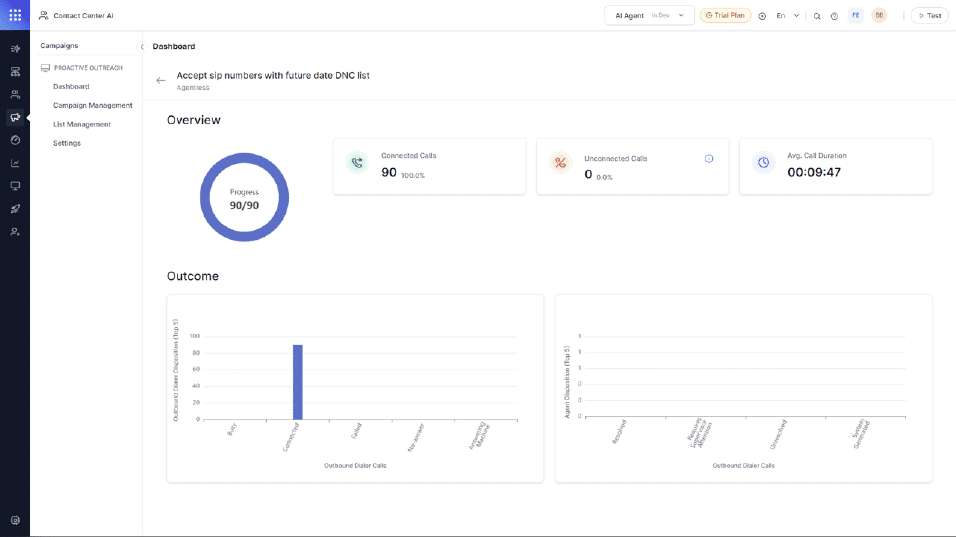

Campaigns:PromoteandManageBusiness withCampaigns

**INTRODUCTION** **TO** **CAMPAIGNS**
> **Campaigns**
> **Voice** **Campaigns**
> **Proactive** **WebCampaigns**
>
> **Analytics**

**KNOWLEDGE** **CHECKS**

> **Check** **YourUnderstanding**

**CONCLUSION**

> **Summary**

Lesson 1 of 6

**Campaigns**

> In the digital age, where connectivity is ubiquitous, and attention
> spans are fleeting,
>
> the effectiveness of traditional advertising methods has diminished.
> As a result,
>
> businesses and organizations are increasingly turning to voice and web
> campaigns to
>
> engage with their target audiences in more dynamic and interactive
> ways. Voice and
>
> web campaigns harness the power of technology to deliver tailored
> messages directly
>
> to consumers.

The
importance of campaigns lies in their ability to
**deliverpersonalized,relevant,and**

**timelymessages**to consumers, fostering meaningful connections and
driving conversions.

Unlike traditional advertising channels, **voiceand** **web**
**campaigns** offer unprecedented levels

of targeting and measurement, allowing businesses to refine their
strategies based on real-time

data and insights.

> Here are a few examples to illustrate the versatility of outreach
> through campaigns:
>
> 1 **PersonalizedOutreach** A telecommunications company sends
> personalized voicemails to customers about new service offerings
>
> based on their usage patterns. For example, a customer who
>
> frequently uses data might receive a voicemail about an upgraded
>
> data plan.
>
> 2 **Event** **Reminders:** An event management company uses voice
> campaigns to remind attendees about upcoming events or
>
> conferences. These automated reminders ensure that attendees
>
> don't miss important dates and times.
>
> 3 **Appointment** **Confirmations:** A healthcare provider utilizes
> automated voice calls to reach out to patients and confirm
>
> upcoming appointments. Patients can have the option to confirm,
>
> reschedule, or cancel appointments by providing voice inputs.
>
> Campaigns can seamlessly invoke automation to execute these
>
> tasks, ensuring efficient appointment management.

Meet Sally, a dedicated member of the KNP Health Care Services team.
Sally’s current focus is

spreading the word about a free health check camp to their customers
scheduled for the

weekend.

> Assigned with the task, Sally was provided with both a call list and a
> Do Not Call (DNC
>
> list. Leveraging the existing XO platform’s **automation**
> capabilities for Creating and
>
> Modifying Appointments, KNP Health Care Services is ready to
> streamline the process.
>
> With the potential of the XO platform’s **Campaigns** feature, Sally
> can now efficiently
>
> orchestrate outreach efforts to customers. By utilizing this tool, she
> can **automate**
>
> communication processes, ensuring swift and effective engagement.
>
> Additionally, customers can benefit from the seamless experience
> provided by XO
>
> platform’s **start** **flows**, connecting them effortlessly with
> either **automatedprocesses**
>
> or dedicated agents during the **outreach** **calls**.
>
> By harnessing **automation** and seamless **agent** **transfer**
> capabilities, campaigns on
>
> **Kore.ai’sExperience** **Optimization** **(XOPlatform** enable
> businesses to craft a **targeted**
>
> **voice** and **proactive** **webcampaigns**effortlessly.
>
> Want to learn about Voice Campaigns on **XO** Platform?
>
> **CONTINUE** **TO** **LEARN** **MORE**

Lesson 2 of 6

**Voice** **Campaigns**

> **Voice**
> **campaigns**

**Voicecampaigns**empower businesses to leverage voice technology’s
immediacy and personal

touch to engage with their audience effectively. These campaigns can
range from simple

informational messages to interactive experiences that prompt real-time
responses from

**Automation**or **Agents.**

> For a successful voice campaign on the XO platform, you need:
>
> **Call** **List:** This is a list of contacts you want to reach out
> to.
>
> **DNC** This is a list of numbers that have asked not to be
> contacted.
>
> **Automation** **AI** This is used to create an experience flow that
> assists customers when they respond to the campaign.
>
> Watch the below video to gain insights into crafting voice campaigns
> and deploying
>
> them on the XO platform.
>
> **Transcript** –
>
> Welcome to XO Platform’s **Voice** **Campaigns**, where efficiency
> meets customer engagement. Our campaigns empower your contact center
> with proactive outreach to your customers about offers, reminders, or
> keeping them informed, all **without** **the** **hassle** **of**
> **manual** **callsor** **messages.**
>
> With XO Platform’s Voice Campaigns, businesses can s**treamline**
> **customercommunication,** ensuring **timely**
> **remindersandpersonalizedoutreach** while freeing up valuable
> resources for other essential tasks.

Campaigns utilize the **start** **flows** created within the contact
center to craft the customer experience and utilize **automation**
**andagent** **transfer**to assist the customer in real-time if the user
chooses to respond.

Let us learn how to create and manage a campaign.

Navigate to **campaigns**on XO platform.

Select **Voice.**

To begin setting up campaigns, You need to add the **contact**
**lists.**

Navigate to the **List** **Management.**

Select **New** **Contact** **list.**

**Label** the **List** and add the **description.**

The CSV template for creating a call list is available here. Download
it, and Update the list with the contact info in the prescribed format.

And Upload the CSV file.

Map the **Excel** columns to the system fields **below,**

Click **Save**

You can also include a **DNC** list in the same way. If a number from
the contact list is found on the do not contact list, the system will
skip calling that number. This ensures that numbers on the DNC list
**won’t** **be** **contacted** during your campaign.

Now Navigate to **Campaign** **Management**

Click on **New** **Campaign.**

Add a label and description.

Under **Contact** **List**, select the List you want to run the campaign
for

Under **DNC** **list**, Select the list you want to do not contact from
the list.

Set **Priority** Between **1** **5.**

When setting the priority between 1 and 5, consider this: if you are
overseeing multiple campaigns with varying priorities, it's crucial that
the campaign management system can efficiently select and transfer
contacts to the Dialer. To achieve this, the Priority Percentage is

calculated by summing up the priority values of each campaign and
dividing it by the total number of campaigns. This result is multiplied
by 100 to express it as a percentage."

**Priority** **Percentage** **=** **(Sum** **of** **Priority** **Value**
**of** **each** **Campaign** **/** **Numberof** **Campaigns)\*100**

Consider two campaigns with priorities of 5 and 3, respectively. To
allocate percentages:

For Campaign 1 The calculation would be (5 divided by the sum of 5 and
3, which is 8 multiplied by 100, resulting in 62.5%.

For Campaign 2 Similarly, it would be (3 divided by 8 multiplied by
100, leading to 37.5%.

This calculation guarantees an **equitable** **allocation** **of**
**percentages**, reflecting each campaign’s priority. It ensures that
contacts are selected for dialing in accordance with these percentages.

Set the dialing Mode as **Agent** **Less.**

Select the **Start** **Flow** you have created for this campaign.

Toggle the button to activate **answeringmachine** **detection.**

Navigate to **Outreach** **strategy.**

Choose the desired **callerID** for outgoing calls.

In the dialing order section, opt for either **“First** **in** **First**
**out"** or **"Last** **in** **First** **out.”**

Adjust the **maximum** **attemptspercontact**, ranging from **1to**
**100.**

Set the **default** **retry** **period** anywhere from **1to** **1440**
**minutes**before attempting contact again.

Specify the **maximum** **ringtime** between **5to** **120**
**seconds.**

Click on **“Save”** to confirm the settings.

Under the action tab, **initiate** **orhalt** **the** **campaign** and
**monitoritsprogress** using the progress bar.

Let us see a campaign in action.

**Campaigns** on the XO platform can utilize automation and agent
transfer functionalities to address **userqueriesandinteractions**
seamlessly during their engagement with the platform’s campaigns.

>  style="width:7.20667in;height:7.05667in" /> style="width:3.21875in;height:8.53123in" />**Pause** **and**
> **reflect**
>
> Now, validate your understanding of voice campaigns by identifying the
> correct response for each question.
>
> **CONTINUE**

**Scene** **1** **Slide** **1**

Continue NextSlide

>  style="width:7.20667in;height:7.05667in" /> style="width:3.21875in;height:8.53123in" />How can Sally respect
> opt-outs when launching her new store campaign to her customer list,
> ensuring compliance?
>
> 1
>
> 2
>
> 3

She can ignore the opt-out preferences and send the campaign message to
everyone.

She can create a separate campaign specifically for those who haven't
opted out.

Sally can include a "Do Not Contact" list for opt-out

contacts when running the campaign to all her contacts.

**Scene** **1** **Slide** **2**

0 NextSlide

1 NextSlide

2 NextSlide

>  style="width:7.20667in;height:7.05667in" /> style="width:3.21875in;height:8.53123in" />When setting up the voice
> campaign in the XO Platform, how can Michael prioritize contacting
> customers with upcoming service appointments based on proximity?
>
> 1

Prioritize contacting clients with soonest appointments

by adding them last & using "Last in First Out" dialing.

> 2 You can't prioritize calling order.

**Scene** **1** **Slide** **3**

0 NextSlide

1 Scene1Slide1

>  style="width:7.20667in;height:7.05667in" /> style="width:3.23958in;height:8.53123in" />**Scenario** **End**
>
> Now that you've grasped Voice campaigns, let's delve into Proactive
> web campaigns.
>
> **START** **OVER**

**Scene** **1** **Slide** **4**

Continue EndofScenario

> Incorporate **Voice** **Campaigns** into your strategy to effectively
> communicate offers,
>
> reminders, and upcoming events, thereby boosting customer engagement
> and
>
> satisfaction.
>
> Want to learn about campaigns for customers on the Website?
>
> **CONTINUE** **TO** **LEARN** **MORE**

Lesson 3 of 6

**Proactive** **Web** **Campaigns**

> Proactive web campaigns embody an active strategy for engaging with
> your customers via
>
> websites. These campaigns are crafted to promote products, services,
> or brand initiatives
>
> directly on the hosting website.

> On XO platform, you can create web campaigns from the ground up, with
> chat
>
> interactions, visually captivating posts, banners, or buttons tailored
> to your brand’s
>
> objectives.
>
> Alternatively, personalize pre-existing templates to align with your
> specific
>
> requirements.
>
> Watch
> the video below to gain insights into creating proactive web campaigns
> and
>
> deploying them on the XO platform.

**Transcript** –

With **XO** **Platform’s**Web Campaigns, you can effortlessly engage
your website traffic with proactive offers, reminders, or updates
without requiring manual calls or messages.

Using **XO** **Platform’sproactive** **webcampaigns**, businesses can
efficiently streamline targeted offers based on rules and measure their
effectiveness by tracking completion through goals.

Now, let’s dive into creating and managing a **webcampaign.**

First, **navigate** **to** **campaigns** on the XO platform, then
proceed to Campaign Management.

Select Proactive Web, where you can create four types of campaigns:

**Chat:** Engage users with chat-based interactions, providing them with
relevant information.

**Post:** Deliver visually appealing post-based interactions.

**Banner:** Display banner-based interactions anywhere on the website.

**Button:** Provide interactive button-based interactions that are fully
customizable to your needs.

Let’s set up a **chat-basedcampaign:**

Click on **New** **Campaign.**

Select **Chat**.

Under the General Tab, **adda** **label** and **description.**

In the **Layout** **Design** tab, enable the message header **toggle**
**button** to include header text and image with your message.

Click on the **edit** **icon** to add a header and Upload an icon.

Proceed to the **Message** **Tab,** where you can add and format your
message to user.

For instance, let’s promote a 15% discount on Mobiles and Electronics.

You have the option to **format** **the** **message** using the format
menu provided here.

Under **Buttons**, Incorporate interactive buttons and tailor their
functions to your preference.

Customize existing buttons by selecting the "edit" option. For new
buttons, click **“addbutton.”**

**Label** **the** **button** accordingly and assign an action using the
dropdown menu.

Tailor the user experience with these interactive buttons. Choose “Send
to URL" to navigate to a specific webpage, **"Sendto** **Bot"** to
engage with automation AI on the XO platform, or **“Dismiss”** for no
action.

Adjust the button’s background and text colors as desired.

**Customize** **the** **appearances**as desired by utilizing the
prebuilt templates and then save the changes.

Under **Engagement** **Strategy,** customize where and how the campaign
will be displayed.

Navigate to the website, and add the **website** **URL** Or page name
where you want to display this campaign.

Ensure that Kore.ai's Widget SDK is configured on the Website you want
this campaign on

You have the option to **enhance** **customization** **usinglogic**. For
example, if you wish to target users who reach the buy iPhone page only
after visiting the main website, you can incorporate a “Then Condition.”

Note that the Rules available for Or and Then

Furnish the subsequent URL. Consequently, this campaign becomes visible
exclusively to users who have traversed this specific path rather than
to every user.

Following that, you can introduce rules to further tailor the campaigns
using metrics such as **user,** **time** **spent,** **page** **visit**
**count,** **country,** **andcity.**

For instance, you can establish a condition such as a requirement that
the user’s country is India. The campaign will then be displayed
exclusively when the condition is fulfilled.

Additionally, you have the option to **incorporate** **goals** to gauge
the effectiveness of the campaign.

Click on **AddGoal.**

For Instance, Set the page Visited to “add to the cart” page.

This feature allows us to monitor the number of campaigns that
effectively directed customers to the add-to-cart page, providing us
with an overview of campaign success.

**Include** **the** **channels**, such as the Voice Web channel or Chat
Web channel , and configure Engagement Hours between Anytime or
customize them to specify when this offer is accessible.

You can now**initiate** **orpause** this campaign from the **campaign**
**management** **session** and track its progress using the progress
bar.

To illustrate campaigns in action, let’s examine a past campaign titled
“Seasonal Shoe Offer.” As depicted, this campaign is now marked as
“**stopped**,” indicating it’s been halted. The campaign type is
specified as a banner.

Here, we can observe the number of times this campaign was presented to
users under the “**Send**” section and how many users navigated to the
URL set under “**Goals”** in the goals session.

Click on the overflow menu and click on the **edit** icon.

In
the layout design tab, you’ll find the message intended for the
customer, presented as a banner. Let’s adjust the placement to the top.

You can view the post we’ve crafted in the **preview** **pane** on the
left.

Under the engagement strategy, include the website URL, establish rules,
and set a condition under the goal section.

This condition stipulates that after users visit the website via the
banner, they must navigate to a page containing “content details” for
the campaign to confirm the goal as completed.

Save the modifications.

Then, click **“Play”** under the action to commence the campaign.

Next, visit the website to view the **banner.**

Now, proceed to a page featuring “content details.” Navigate back to the
**campaigns** page**.**

Here, you’ll notice that this campaign is active and has been
**executed**once, **achievingthe** **goal** **once.**

With XO Platform: campaign’s versatile features and intuitive interface,
crafting engaging web campaigns is just a few clicks away. Start
maximizing your website’s potential today!

> To initiate **Proactive** **WebCampaigns,** configuring the **WebSDK**
> is essential during the deployment of the App. Further details
> regarding this setup are available in the **"Deploy"** section.
>
> Ready to assess your understanding of Proactive Web Campaigns

You want to create a web
campaign that offers a discount to users who

browse your phone and laptop case categories. How can you achieve this

targeted messaging using XO Platform’s features?

> Design a visually appealing banner showcasing the discount.
>
> Include a chat message directly mentioning phones and laptops.
>
> Utilize logic rules within the Engagement Strategy to target users who
> visited those categories.
>
> **SUBMIT**
>
> Campaign analytics helps analyze the performance of a campaign. Go
> ahead to learn more!
>
> **CONTINUE** **TO** **LEARN** **MORE**

Lesson 4 of 6

**Analytics**

> The Dashboard furnishes a comprehensive overview encompassing all
> campaigns
>
> generated on the XO platform, offering detailed insights into each
> campaign.
>
>  style="width:6.375in;height:3.58333in" />Campaign - Dashboard
>
> Navigate to Dashboard Sessions under Campaigns.
>
> The landing page displays the high-level insights of all campaigns
> created on the XO
>
> Platform. By selecting a specific campaign, you can delve into more
> profound insights,
>
>  style="width:6.375in;height:3.58333in" />such as:
>
> Campaign DashBoard
>
> **Connected** **Calls:** The count of calls successfully connected
> from the contact list.
>
> **Unconnected** **Calls:** The tally of calls that failed to connect
> from the contact list.
>
> **Avg.Call** **Duration:** The average duration of time users spend on
> calls within this campaign.
>
> **Outbound** **Dialer** **Dispositions:** The top 5 dialer
> dispositions recorded by the system upon dialing a number.
>
> **Agent** **Dispositions:** The top 5 dispositions marked by agents
> when users connect to them via the campaign.
>
> Now, its time to check your understanding!
>
> **CONTINUE**

Lesson 5 of 6

**Check** **Your** **Understanding**

In order to get credits, you must pass the knowledge check.

Total number of questions: **5**

Passing score: **80%**

Number of attempts: **unlimited**

**GoodLuck!**

**Question**

01/05

Which feature of campaigns on the XO Platform allows businesses to
effortlessly

reach out to customers for appointment confirmations and updates?

> Automated voice campaigns
>
> Manual text messages
>
> Banners and Posts on Website

**Question**

02/05

How does the XO Platform ensure seamless execution of tasks within
campaigns?

> By relying solely on manual intervention by agents
>
> Through automation and agent transfer capabilities
>
> By limiting campaign scopes to Small Tasks

**Question**

03/05

Which feature of the XO Platform allows businesses to tailor the
customer experience

within campaigns?

> Automation flows
>
> Contact Center flows
>
> Assist flow
>
> Outreach flow
>
> Welcome Flows

**Question**

04/05

What is a key advantage of web campaigns compared to traditional
advertising

channels?

> Limited targeting options
>
> Static and unchangeable content
>
> Ability to track performance metrics
>
> Real-time data insights and measurement capabilities of Campaign
> Effectiveness

**Question**

05/05

When running multiple campaigns simultaneously with different priority
levels, the

calling sequence follows a specific pattern to ensure balanced outreach
across

campaigns. If you have campaign 1 with priority 2 and campaign 2 with
priority 5,

each with 10 contacts, what will be the priority sequence?

> Campaign 1 Priority 28.57%, Campaign 2 Priority 71.43%
>
> Campaign 1 Priority 71.43%, Campaign 2 Priority 28.57%
>
> Campaign 1 Priority 50%, Campaign 2 Priority 50%
>
> Campaign 1 Priority 40%, Campaign 2 Priority 60%

Lesson 6 of 6

**Summary**

> With campaigns on the XO platform, you can harness automation and
> agents to craft
>
> campaigns that not only disseminate information to customers but also
> assist them by
>
> managing their responses.
>
> **Key**
> **Takeaways**
>
> Here’s what you have learned in this course.
>
> 1 Understanding and utilizing Campaigns on the XO platform for
> customer engagement.
>
> 2 Exploring the process of setting up and initiating Voice campaigns.
>
> 3 Exploring the process of setting up and initiating Proactive Web
> campaigns.
>
> 4 Familiarize with campaign dashboards.
>
> **To** **learn** **more,** **please** **referto** **the** **Kore.ai**
> **Academy** **andthe**
>
> **documentation.**
>
> Thank you for completing this course!
